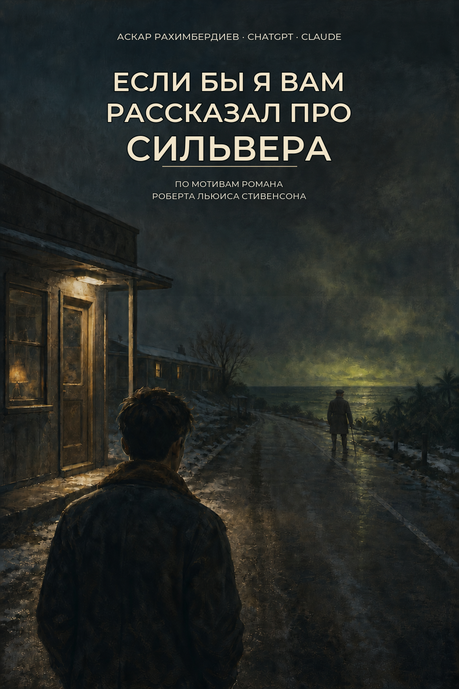

<p align="center">
  
</p>

<h1 align="center">Если бы я вам рассказал про Сильвера</h1>

<p align="center">
  Литературный ремейк «Острова сокровищ» Роберта Льюиса Стивенсона<br>
  в США и Карибах начала 1950-х
</p>

<p align="center">
  <strong>Аскар Рахимбердиев, ChatGPT и Claude</strong>
</p>

<p align="center">
  <a href="https://raw.githubusercontent.com/askar-code/treasure-island-remake/main/output/pdf/esli-by-ya-vam-rasskazal-pro-silvera.pdf"><strong>Скачать PDF</strong></a>
  ·
  <a href="https://raw.githubusercontent.com/askar-code/treasure-island-remake/main/output/epub/esli-by-ya-vam-rasskazal-pro-silvera.epub"><strong>Скачать EPUB</strong></a>
</p>

## О книге

Конец октября 1952 года. В бедном придорожном мотеле у холодной бухты Новой Англии поселяется тяжёлый молчаливый человек по имени Билли Бонс. Он платит наличными, всё время смотрит на дорогу и просит шестнадцатилетнего Джима следить, не появится ли поблизости одноногий моряк.

Потом приходит слепой.

Дальше начинает работать знакомый механизм: бумаги, карта, старая `Испаньола`, подозрительно набранная команда, мятеж, остров и Джон Сильвер. Но привычное приключение рассказано заново — как послевоенная подростковая исповедь о побеге, зависимости, ложном наставнике и взрослых, которые умеют придавать грязному компромиссу законный и разумный вид.

Это самостоятельный русскоязычный литературный ремейк, а не перевод и не построчная модернизация оригинала.

## Что изменилось

- `Адмирал Бенбоу` стал разоряющимся семейным мотелем в Новой Англии.
- `Испаньола` — старая двухмачтовая вспомогательная шхуна, выходящая из зимнего Бостона.
- Остров — заброшенный довоенный карибский курорт: бетонный недострой, мангры, ржавые трубы, пустой бассейн и следы проекта, закончившегося после Пёрл-Харбора.
- Люди Сильвера — не костюмные пираты, а мужчины, прошедшие войну, флот, госпитали, склады и послевоенную торговлю.
- Клад — не награда за приключение, а груз, в котором деньги смешаны с украденными вещами, чужими именами и доказательствами убийства.
- Джиму шестнадцать. Он умный, язвительный, тревожный и особенно легко верит взрослому, который замечает его и даёт ему настоящую работу.
- Сильвер слушает Джима лучше большинства порядочных взрослых. Поэтому его предательство остаётся интимным даже тогда, когда он снова становится союзником по расчёту.

У ремейка ровно 34 нумерованные главы: каждая сохраняет драматическую функцию соответствующей главы `Острова сокровищ`, но переносит действие, предметы и нравственный конфликт в 1952–1953 годы. Между главами 21 и 22 стоит ненумерованная интерлюдия Смоллетта; ещё две короткие взрослые сцены встроены в главы 28 и 30.

## Готовое издание

- [PDF](https://raw.githubusercontent.com/askar-code/treasure-island-remake/main/output/pdf/esli-by-ya-vam-rasskazal-pro-silvera.pdf) — 449 страниц формата A5.
- [EPUB](https://raw.githubusercontent.com/askar-code/treasure-island-remake/main/output/epub/esli-by-ya-vam-rasskazal-pro-silvera.epub) — электронная версия с навигацией по главам.
- Обложка и 22 внутренние иллюстрации.
- Язык — русский.
- Год первого электронного издания — 2026.

Иллюстрации размещены непосредственно рядом с изображёнными сценами. В сборщике каждая картинка привязана к конкретному текстовому абзацу: если этот якорь исчезнет при будущей правке, сборка остановится с ошибкой, а не молча перенесёт иллюстрацию в случайное место.

## Открытые исходники

Репозиторий содержит не только готовую книгу, но и всю рабочую систему проекта:

| Что | Где |
| --- | --- |
| 34 главы | [`chapter-01.md`](chapter-01.md) — [`chapter-34.md`](chapter-34.md) |
| Интерлюдия Смоллетта | [`interlude-smollett.md`](interlude-smollett.md) |
| Концепция и художественный договор | [`materials/remake-goal-catcher-rye.md`](materials/remake-goal-catcher-rye.md) |
| Канон, календарь и континуити | [`materials/canon-and-continuity.md`](materials/canon-and-continuity.md) |
| Стилевой справочник | [`materials/style-guide.md`](materials/style-guide.md) |
| Функции 34 глав оригинала | [`materials/reference/treasure-island-plot-by-chapter.md`](materials/reference/treasure-island-plot-by-chapter.md) |
| Исследования эпохи и судна | [`materials/research/`](materials/research/) |
| Визуальная библия персонажей | [`materials/visual-character-bible.md`](materials/visual-character-bible.md) |
| Промпты и история отбора иллюстраций | [`publication/image-prompts.md`](publication/image-prompts.md) |
| Сборщик PDF и EPUB | [`publication/build_book.py`](publication/build_book.py) |
| Издательская инструкция | [`publication/README.md`](publication/README.md) |

История Git сохраняет редакторские проходы и позволяет увидеть, как менялись главы, канон, формулировки и издательская сборка.

## Исследовательская фактура

Возможно, самая интересная часть рабочих материалов — [исследования](materials/research/), которые ИИ собрал для романа и которые затем сверялись с рукописью.

Они отвечают, среди прочего, на такие вопросы:

- что делали с телом умершего в Новой Англии зимой, когда земля промёрзла и могилу нельзя выкопать до весны;
- как работал спаренный сельский телефон и что означали разные комбинации звонков;
- сколько стоили страховой полис, похороны, отопление, еда и повседневные вещи в 1952–1953 годах;
- что слушали по радио, смотрели в кино и обсуждали подростки той зимой;
- как был устроен небогатый придорожный мотель;
- какой двигатель мог стоять на старой вспомогательной шхуне, как его обездвижить и затем снова запустить;
- как на судне хранили воду, готовили еду, несли вахту, обращались с парусами, якорями, оружием и ранеными;
- какие бытовые, культурные, морские и технические анахронизмы ломали бы именно 1952–1953 годы.

Фактура входит в прозу через предмет, работу, цену, тело или последствие, а не отдельной исторической лекцией.

## Как использовался ИИ

Книга не была создана одним запросом «напиши роман».

ChatGPT и Claude участвовали в разработке сцен, написании и переписывании текста, исследованиях, проверке континуити, литературной редактуре и предпубликационной вычитке. ИИ также помогал готовить и исправлять иллюстрации. Аскар Рахимбердиев задавал художественную конструкцию, принимал или отвергал варианты и проводил окончательный авторский отбор.

Имена всех трёх участников вынесены на титульную страницу. Роберт Льюис Стивенсон указан как автор оригинального романа и источник вдохновения.

## Сборка

Для сборки нужны Python 3, Pillow и ReportLab. Из корня репозитория:

```bash
python3 publication/build_book.py --all
```

Готовые файлы появятся в `output/pdf/` и `output/epub/`. Дополнительные режимы и требования описаны в [издательской инструкции](publication/README.md).

## Ошибки и предложения

Сообщения об опечатках, неясных местах, фактических ошибках, анахронизмах и нарушениях континуити можно оставлять в Issues. Точечные исправления можно предлагать через pull request.

## Лицензия

Оригинальные материалы этого репозитория опубликованы по [лицензии MIT](LICENSE). Она разрешает использовать, копировать, изменять, распространять и продавать материалы при сохранении уведомления об авторском праве и текста лицензии.

Роман Роберта Льюиса Стивенсона `Treasure Island` / `Остров сокровищ`, послуживший основой ремейка, находится в общественном достоянии. Лицензия этого репозитория не ограничивает права на оригинальное произведение.
